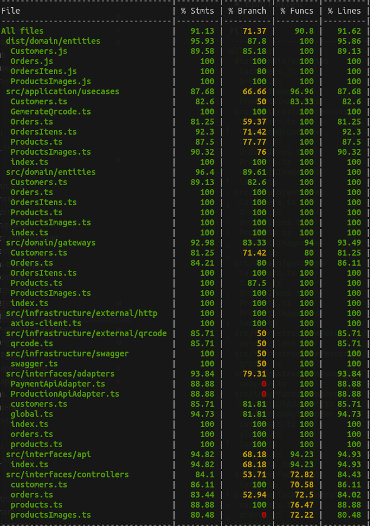
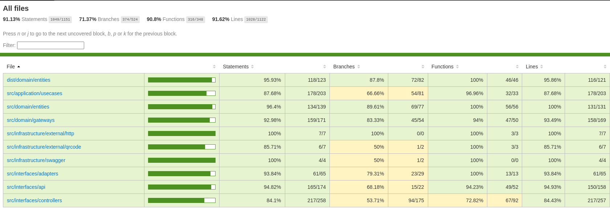

   


# Tech Challenge - Fase 04 (GRUPO 31) - Sistema de gestão de pedidos - Microserviço de Clientes, Produtos e Pedidos

Consiste no microserviço de um sistema de gestão de pedidos para processamento de clientes, produtos e "pedidos" incluindo as seguintes caracteristicas:

Toda documentação DDD com seus diagramas, linguagem úbiqua está disponível no link (notion) a seguir:

[Documentação](https://2cx.notion.site/dbd5a5e318554fbc9e9fcee88e9c4caa?v=72aefde135fc4fd1b886c9693b3426c2&pvs=25)

Tambem esta disponível no link a seguir local abaixo:

[Documentação Local](/docs/ddd.md)

Para uma visualização completa em PDF é possivel visualizar no documento abaixo:

[Documentação Pdf](/docs/documentation.pdf)

## Caracteristicas

- Enpoint's para cadastro, consulta, remoção e atualização de clientes
- Enpoint's para cadastro, consulta, remoçãoe atualização de produtos
- Enpoint's para cadastro, consulta, remoção e atualização de imagens de produtos
- Enpoints para criar novo pedido (order), incluíndo os produtos selecionados.
- Enpoints's para consulta de pedido por id, por status do pedido
- Enpoints para remoção de pedido por id
- Enpoints para atualização de status de pedido (para receber o status do andamento do pedido que vem do microserviço de "preparação do pedido")
- Pipeline GitActions Workflow para execução de testes e build da imagem em ECR AWS

## Requisitos para execução direta

- Debian: 11 ou superior | Ubuntu: 20
- Node: 18 ou superior
- Banco de dados Mongdb ou DocumentDb

## Requisitos para execução via docker

- Docker: 20 ou superior
- Docker-compose: 1.29.2 ou superior

## Execução dos testes unitários

- npm run test



Coverage



## Execução dos testes unitários

- npm run test

## Gerar a versão de distribuição /dist ( se necessário )

Executar o comando abaixo para gerar automaticamente o dist
- npm run build

## Execução via docker
A execução da aplicação via docker-compose permite a execução do microserviço com escalabilidade horizontal (via replicas do container).

Para executar o modelo padrão da atividade executando 2 instâncias (1 para aplicação e 1 para o banco de dados), acesse o diretorio onde está o código e digite o comando a seguir:

    docker-compose up

Ele irá provisionar uam instância de banco de dados (mongodb) e aplicar um build no Dockerfile para provisionar a instância de aplicação. Em tela irá apresentar o log continuo da execução dos serviços.

Para executar o pacote sem visualizar os log's, execute o comando abaixo:

    docker-compose up -d

Para encerrar o serviço digite o comando a seguir: 

    docker-compose down

## Documentação das API's

A documentação pode ser acessada via browser digitando o endereço abaixo quando a aplicação estiver em execução:

    http://localhost:8080/api-docs/

Para acessar diretamente [clique aqui](http://localhost:8080/api-docs/)

O swagger é um framework composto por diversas ferramentas que, independente da linguagem, auxilia a descrição, consumo e visualização de serviços de uma API REST e foi selecionado para documentação dos endpoints do backend da aplicação.

- CLIENTES (customer)
    - permite criar um novo cadastro de cliente
    - permite consultar um cadastro pelo cpf
    - permite consultar todos os cadastro ( novo )
    - permite consultar um cadastro por id ( novo )
    - permite atualizar um cadastro por id ( novo )
    - permite remover um cadastro por id ( novo )
- PRODUTOS
    - permite buscar todos os produtos ( novo )
    - permite buscar produtos por categorias pré definidas 'ACCOMPANIMENT', 'DESSERT', 'DRINK' e 'SNACK'
    - permite buscar produtos por id
    - permite remover produtos por id
    - permite cadastrar um novo produto em uma das categorias pré definidas
    - permite atualizar um produto existente
- PEDIDOS
    - permite criar um novo pedido enviando os produtos seleecionados
    - permite atualizar a situação (status) do pedido
    - permite consultar pedidos por situação (status)
    - permite atualizar o status de um pedido ( novo )
    - permite consultar um pedido por id ( novo )
    - permite remover um pedido por id ( novo )
    - permite atualizar o status de pagamento de um pedido por id ( novo )

## Jornada de teste

Cadastra um produto "lanche"
```
curl --location 'http://localhost:8080/products' \
--header 'Content-Type: application/json' \
--data '{
  "name": "Cheeseburger (P)",
  "price": 11.90,
  "category": "SNACK",
  "description": "Hamburger de 70g (pão, molho rosé, queijo tipo cheddar, alface e tomate)"
}'

```

Cadastra um produto "bebida"
```
curl --location 'http://localhost:8080/products' \
--header 'Content-Type: application/json' \
--data '{
  "name": "Suco de uva",
  "price": 11.90,
  "category": "DRINK",
  "description": "Suco"
}'
```

Atualiza produto
```
curl --location --request PUT 'http://localhost:8080/products/64ea48eaa5925b790c90e7d2' \
--header 'Content-Type: application/json' \
--data '{
    "name": "Cheeseburger (P)",
    "price": 20.90,
    "category": "SNACK",
    "description": "Hamburger de 70g (pão, molho rosé, queijo tipo cheddar, alface e tomate)"
}'
```

Deleta um produto
```
curl --location --request DELETE 'http://localhost:8080/products/64ea48eaa5925b790c90e7d2'
```

##### Buscar todos os produtos
```
curl --location 'http://localhost:8080/products'
```

##### Buscar um produto por ID
```
curl --location 'http://localhost:8080/products/64ea48cea5925b790c90e7d0'
```

Buscar um produto por categoria
```
curl --location 'http://localhost:8080/products?category=SNACK'
```

Criar um cadastro de cliente.
```
curl --location 'http://localhost:8080/customers' \
--header 'Content-Type: application/json' \
--data '{
    "name": "Grupo 31",
    "mail": "",
    "cpf": "44445337064",
    "birthdate": "1986-04-04",
    "subscription": "Informação adicional"
}'
```

##### Cadastra uma imagem de um produto
```
curl --location 'http://localhost:8080/products/64ea6e99d69544e1cdb1f680/images' \
--header 'Content-Type: application/json' \
--data '{
    "name": "Principal",
    "size": "10",
    "type": "SNACK",
    "base64": "data:image/jpeg;base64,/9j/4AAQSkZJRgABAQAAAQABAAD/2wBDAAoHBwkHBgoJCA.....L1ejMzMzMzMzMzMzMzMzMzM9WZn/d/9k="
}'

```

##### Busca todas as imagens de um produto
```
curl --location 'http://localhost:8080/products/64ea6e99d69544e1cdb1f680/images'
```

##### Busca uma imagem especifica de um produto
```
curl --location 'http://localhost:8080/products/64ea6e99d69544e1cdb1f680/images/64ea6eebd69544e1cdb1f683'
```

##### Atualiza uma imagem especifica de um produto
```
curl --location --request PUT 'http://localhost:8080/products/64ea6e99d69544e1cdb1f680/images/64ea6eebd69544e1cdb1f683' \
--header 'Content-Type: application/json' \
--data '{
    "name": "Principal",
    "size": "10",
    "type": "SNACK",
    "base64": "data:image/jpeg;base64,/9j/4AAQSkZJRgABAQAAAQABAAD/2wBDAAoHBwkHBAkLCwo...L1ejMzMzMzMzMzMzMzMzMzM9WZn/d/9k="
}'
```

##### Remove uma imagem especifica de um produto
```
curl --location --request DELETE 'http://localhost:3000/products/64ea6e99d69544e1cdb1f680/images/64ea6eebd69544e1cdb1f683'
```

##### Criar um cadastro de cliente.
```
curl --location 'http://localhost:8080/customers' \
--header 'Content-Type: application/json' \
--data '{
    "name": "Grupo 31",
    "mail": "",
    "cpf": "44445337064",
    "birthdate": "1986-04-04",
    "subscription": "Informação adicional"
}'
```

##### Buscar todos os clientes
```
curl --location 'http://localhost:8080/customers'
```

##### Buscar um cliente por id
```
curl --location 'http://localhost:8080/customers/64e262c9c949fba1be313182'
```

##### Buscar um cliente por cpf
```
curl --location 'http://localhost:8080/customers?cpf=44445337064'
```

#### Criar um pedido ( retorna _protocol_ == numero do pedido e _id chave), retornando o pedido por completo
```
curl --location 'http://localhost:8080/orders' \
--header 'Content-Type: application/json' \
--data '{
    "customerId": "64e262c9c949fba1be313182",
    "orderItens": [{
        "productId": "64ea4849a5925b790c90e7c6",
        "quantity": 3,
        "obs": "Sem cebola"
    },{
        "productId": "64ea5370da7c340abe23dba3",
        "quantity": 3,
        "obs": "gelada"
    }]
}'
```

Busca pedidos pela situação do pedido (status)

```
curl --location 'http://localhost:8080/orders/status/IN_PROGRESS'
```
```
curl --location 'http://localhost:8080/orders/status/DONE'
```

Busca pedidos pelo ID

```
curl --location 'http://localhost:8080/orders/64ea538bda7c340abe23dba9'
```

Atualiza status do pedido por id ( incluso regras de validação do status a ser executado )
```
curl --location --request PUT 'http://localhost:8080/orders/64ea538bda7c340abe23dba9' \
--header 'Content-Type: application/json' \
--data '{
    "status": "CANCELED"
}'
```


## Requisitos para teste unitário automatizado via GitActions e BuildImage para registro no ECR AWS

* [Terraform](https://www.terraform.io/) - Terraform is an open-source infrastructure as code software tool that provides a consistent CLI workflow to manage hundreds of cloud services. Terraform codifies cloud APIs into declarative configuration files.
* [Amazon AWS Account](https://aws.amazon.com/it/console/) - Amazon AWS account with billing enabled
* [aws cli](https://aws.amazon.com/cli/) optional

## Antes de começar

Esta execução esta fora do nível gratuito da AWS, importante avaliar antes de executar

## AWS configuração

Com os requisitos já identificados, configure abaixo no secrets do github.

```
AWS_ACCESS_KEY = "xxxxxxxxxxxxxxxxx"
AWS_SECRET_KEY = "xxxxxxxxxxxxxxxxx"
SONAR_HOST_URL = "xxxxxxxxxxxxxxxxx"
SONAR_TOKEN    = "xxxxxxxxxxxxxxxxx"
```

## Uso

Com os requisitos já identificados, as variáveis configuradas no secrets do github.

Efetue o Pull Request com a branch master para executar o processo de

- Teste
- Sonarqube
- Deploy

### Execução do projeto

Ao efetuar um push no repositório develop com sucesso, é necessário efetuar um pull request na branch master para que a execução do pipeline do workflow seja executado

